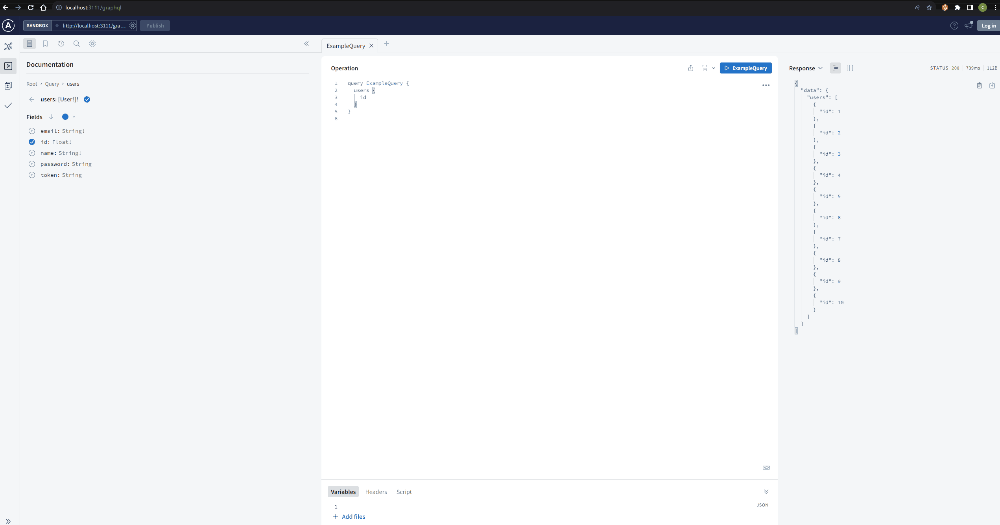

## TS CA NODE Demo


### Tech Stack

- [x] ca
- [x] nodemon
- [x] ts
- [x] swagger
- [x] inversify
- [x] jsonplaceholder
- [x] winston
- [x] bcryptjs
- [x] graphql
- 
- 
- [x] jest

```javascript
$ mkdir ca-node-demo

$ npm init -y

$ npx --package typescript tsc --init
or npm install typescript@latest -g
tsc --init

$ yarn add inversify inversify-express-utils express reflect-metadata dotenv cors

$ yarn add -D @types/express @types/cors

$ npm init @eslint/config

$ yarn add -D eslint nodemon
# or $ yarn add -D ts-node-dev

$ yarn add -D typescript ts-node @typescript-eslint/eslint-plugin @typescript-eslint/parser

# swagger  http://localhost:3111/api-docs
$ yarn add swagger-ui-express swagger-jsdoc
$ yarn add -D @types/swagger-ui-express @types/swagger-jsdoc

# logger
$ yarn add winston

# bcryptjs
$ yarn add bcryptjs jsonwebtoken
$ yarn add -D @types/bcryptjs @types/jsonwebtoken

# graphql
$ yarn add @apollo/server graphql express cors body-parser @graphql-tools/schema type-graphql
$ yarn add -D @types/graphql @types/cors @types/express @types/body-parser

$ yarn build
$ yarn start:dev
# http://localhost:3111/users

# test
$ yarn add -D jest ts-jest @types/jest
# create js config
$ npx ts-jest config:init
$ yarn test
```
